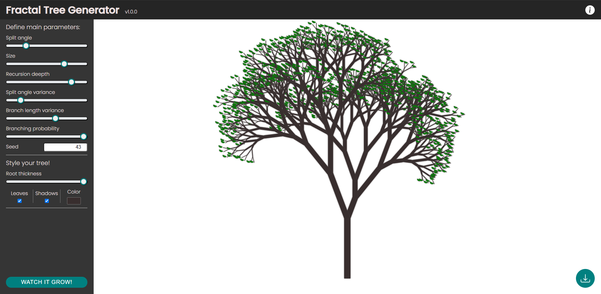

# Fractal Tree Generator

Prosta aplikacja rysująca za pomocą html canvas drzewiasty fraktal. 

Interfejs pozwala na edycję rozmaitych parametrów głównie za pomocą formularzy znajdujących się w menu bocznym. Parametry odpowiadają za strukturę drzewa oraz jego styl. Klikając w przycisk "WATCH IT GROW" w lewym dolnym roku można zobaczyć animację rysowania drzewa od korzenia w górę. Za animację odpowiada Web Worker, który poprzez transfer otrzymuje element OffscreenCanvas oraz poprzez kopiowanie strukturę drzewa rozbitą na punkty wraz z niezbędnymi informacjami dotyczącymi styli. Stworzone drzewo można pobrać w formacie JPEG klikając w przycisk w prawym dolnym rogu ekranu.

## Wykorzystane technologie
* HTML5, 
* CSS3 (min. flexbox i transition)
* JavaScript (ES6), 
* Web Wrokers, 
* OffscreenCanvas 

## Obsługa przeglądarek
Projekt został przygotowany na przeglądarkę *Google Chrome v84+*